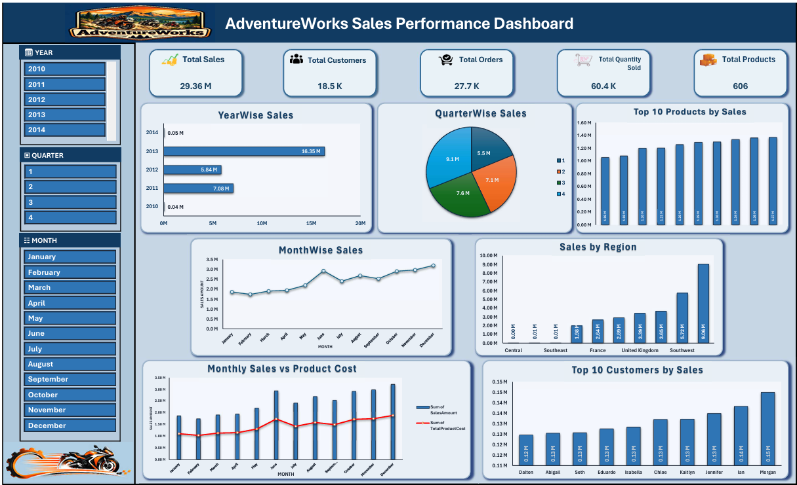

# AdventureWorks Sales & Business Analytics Dashboard | Excel

## 📌 Project Overview

This project was completed as part of my **Data Analytics training and project work at ExcelR** using the AdventureWorks dataset.

The project focused on data cleaning, data transformation, data modeling, analysis, and the development of an interactive Excel dashboard to analyze sales and business performance.

## 📊 Dashboard Preview



## 🎯 Project Objectives

- Clean and prepare the AdventureWorks data for analysis
- Combine sales datasets using Append/Union
- Merge related dimension tables using Left Join
- Build a relational data model using a Star Schema
- Perform sales and business analysis using Excel
- Create Pivot Tables, charts, KPIs, and interactive filters
- Develop an interactive final dashboard

## 🔄 Data Preparation & Transformation

The project involved the following data preparation steps:

- Imported and reviewed Fact and Dimension tables
- Cleaned the datasets and removed unnecessary/null fields where required
- Corrected and standardized data types
- Appended sales datasets to create a combined Fact Sales dataset
- Merged product-related tables using Left Join
- Combined:
  - DimProduct
  - DimProductCategory
  - DimProductSubCategory
- Created a consolidated `DimProductMerged` table

## ⭐ Data Modeling

A Star Schema / relational data model was created using:

### Fact Table
- `Final_Fact_Sales`

### Dimension Tables
- `DimCustomer`
- `DimDate`
- `DimSalesTerritory`
- `DimProductMerged`

Relationships were established between the Fact and Dimension tables using the relevant keys.

### Model Structure

```text
                 DimCustomer
                      |
                      |
DimDate ---- Final_Fact_Sales ---- DimProductMerged
                      |
                      |
              DimSalesTerritory
